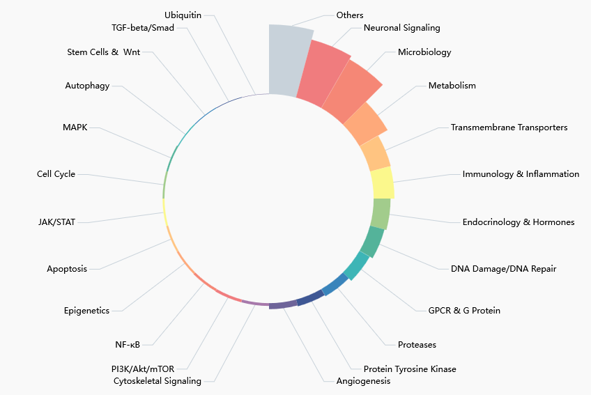

# Capstone Project: Beyond Chemical Structure: An Inference Pipeline for Predicting Drug Candidates via Therapeutic and Physicochemical Descriptors

### Table of contents
 1. Project Description
  2. Use Case
 3. Contents
  4. Limitations
  5. Challenges
  6. Credits

## Project Description

**Cardiovascular diseases** (CVDs) are the leading cause of death. Of CVDs, congenital heart diseases are the most common congenital defects, with a prevalence of 1 in 100 live births. Despite the widespread knowledge that prenatal and postnatal drug exposure can lead to congenital abnormalities, the developmental toxicity of many FDA-approved drugs is rarely investigated. Therefore, to improve our understanding of drug side effects, we performed a high-content drug screen of **1,280 compounds** from the **Prestwick Drug Library** using zebrafish (*Danio rerio*) as an *in vivo* model for cardiovascular analyses. Zebrafish are a well-established model for CVDs and developmental toxicity. Here, we utilized the heart rate as a measurement under the assumption, that functional and developmental defects will result in an altered heartbeat. In our study, about 10.5% of the tested drugs significantly affected HR at a concentration of **20 µM** in zebrafish embryos at 2 days post-fertilization.

***Figure 1** (A) High-content screening results for z-normalized heart rate data, obtained by analysis with HeartBeat software (v.2.1). Z-scores above or below +/-1.96 are considered significant with a 95% CI. For the primary screen, effect sizes of a 90% CI (+/-1.64) were considered to reduce false-negative results. The center pie-chart shows the therapeutic classes of the 134 hits (90% CI). The therapeutic classes of the remaining 31 hits after filter application is shown on the right. (B) The structure of selected hit compounds with cardioactive properties. Class = therapeutic class; CNS = central nervous system; EMA = European Medicines Agency; FDA = Food and Drug Administration; HCl = Hydrochloride; OTC = over-the-counter drug; anatomical therapeutic chemical (ATC) classification are displayed (indicated by #) if available.*

## Use Case

As previously described, this project utilizes data from the PhD project <a href="https://d-nb.info/1376022915" target="_blank" style="color:#66ccff; text-decoration:none;"> 
"High-content screening for cardiovascular modulators in zebrafish (*Danio rerio*)"</a> by Viviana Vedder from 2024, that has been partially published together with a newly developed tool <a href="https://www.frontiersin.org/journals/cell-and-developmental-biology/articles/10.3389/fcell.2023.1143852/full" target="_blank" style="color:#66ccff; text-decoration:none;"> 
pyHeart4Fish</a> in 2023. 

This project aims to predict the effects of compounds on zebrafish heart rate to adhere to the 3R principle of reduce, refine, replace to reduce the resources required for drug screens. The y in this project is the Z HB column. To achieve this aim, the following objectives were set:

- Creating a cohesive table with clean, consistent data.
- Exploring the Drug Library used for this screening.
- Transforming numerous categorical columns into numerical data.
- Applying the "Horse-race"-Approach to identify the most suitable ML algorithm.
- Applying the best algorithm to the data.
- Testing the trained algorithm on new data (unsupervised learning).
- Assessing the performance.

 

  <ul style="font-size:17px; line-height:1.9; margin:0; list-style:none; padding-left:0;">
    <li>🐟 Which <b>therapeutic classes</b> were most represented across the Prestwick Drug Library 2019?</li>
    <li>🐟 Which <b>human genes</b> for the respective <b>target proteins</b> were most represented?</li>
    <li>🐟 What is the ratio of <b>light-sensitive drugs</b> within the drug library?</li>
    <li>🐟 Is there a connection between zebrafish <b>heart rate</b> and <b>therapeutic class</b>?</li>
  </ul>

  <ul style="font-size:17px; line-height:1.9; margin:0; list-style:none; padding-left:0;">
    <li>🐟 Which <b>features</b> are actually relevant for the prediction of the <b>heart rate</b>?</li>
    <li>🐟 Are there groups of <b>human genes</b> with association to <b>heart rate</b>?</li>
    <li>🐟 Does the frequency of <b>human genes</b> within the drug library create a bias in the <b>unsupervised ML</b>?</li>
  </ul>

## Contents

This repository contains one animated gif as header of the Jupyter Notebook containing the Python code, a publicly available png for the Selleckchem Drug Library as well as the Jupyter Notebook file.

#### 1.1.1 Datasets
The names of the drugs contained in the Selleckchem Drug Library are publicly available. However, the Prestwick Chemical Library information was provided by the company with the acquisition of the physical library and can therefore not be shared.

##### 1.1.1.1 Labelled Data

***Figure 2** Screening and data analysis workflow*

The data was obtained by collecting zebrafish eggs after 1 h of pair- or group-wise mating before over-night incubation. At 21 hours post-fertilization (hpf), the chorion (egg shell) of the embryos was removed (dechorionation). Then, at 24 hpf embryos were treated with compounds from the Prestwick Drug Library. Treatment was stopped at 48 hpf, and fish were mounted in orientation plates to visualize fluorescent hearts using the ACQUIFER imaging machine. Then quantitative data was obtained via analysis with pyHeart4Fish.

https://www.frontiersin.org/journals/cell-and-developmental-biology/articles/10.3389/fcell.2023.1143852/full

##### 1.1.1.2 Unlabelled Data

***Figure 3** Selleckchem Drug Library Composition*

The compounds were taken from the Selleckchem FDA-approved Drug Library, Cat.No.L1300. A unique collection of 3192 approved drugs and API included in pharmacopoeia for high throughput screening (HTS) and high content screening (HCS). Bioactivity and safety confirmed by clinical trials. Structurally diverse, medicinally active, and cell permeable.

## Limitations

The Capstone Project v.1 is still a prototype. A primary limitation is that the current model operates exclusively on z-score normalized data; future research should apply this pipeline to raw data or log-transformed data to better manage outliers. Additional refinements will be performed to also include the chemical properties/structures in the dataset to train the model and additional parameters will be tested. Further, this algorithms puts a lot of importance on known phenotypes in humans. This limits the model in the practical application, therefore the model needs to be refined to work well without this parameter.

## Challenges

One challenge is that at the moment the datasets used are so different in size, therefore more compounds need to be extracted for the Selleckchem library. Also, using AI generated information makes the data very variable and a lot of data cleaning had to be performed. I am hoping to find a way to call the information from reputable sources to increase data quality. Another challenge is the differences in algorithms and finding a good way to prepare the data so that all horse race algorithms were working properly.

## Credits

I would like to acknowledge my mentor Sven Ertel who also provided me with a script to deal with difficult reformatting of a table.
Further, this notebook applied the DOP tools API to preprocess chemical SMILES codes and will use it in the future to process the SMILES for machine learning (https://pubs.rsc.org/en/content/articlelanding/2025/dd/d4dd00399c).
